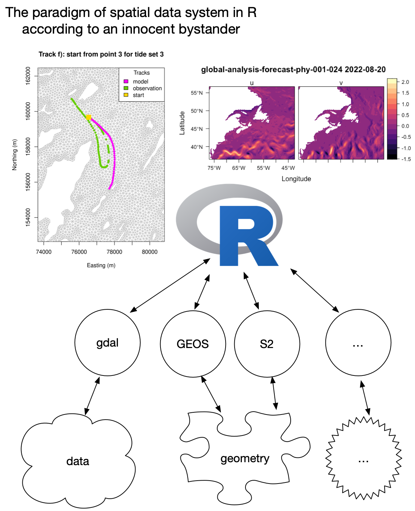
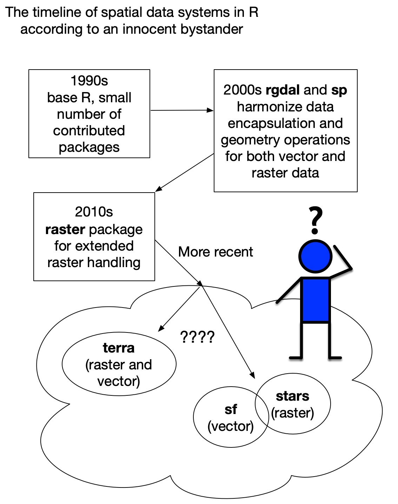
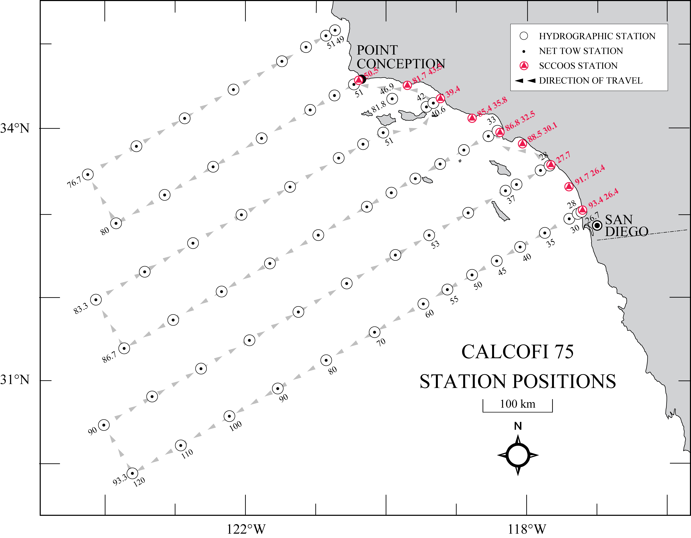
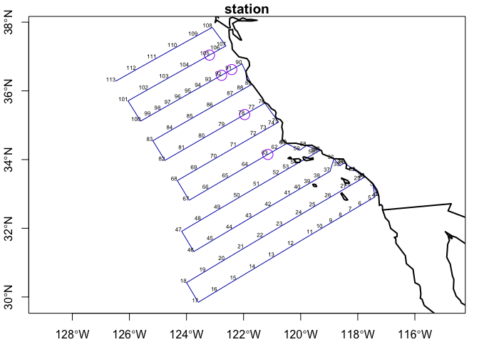

Terra and Stars
================

## The spatial paradigm

R provides a wide variety of tools for reading, writing, analyzing and
displaying spatial data. Most of the computational work for input-output
and geometry manipulations is passed off to well known and stable
external libraries. Much of the display and analysis happens within R
(but not exclusively).



## The recent spatial journey

From the beginning the authors of R were interested in showing spatial
information. Soon, supporting packages were added that provided access
to various input-output utilities, spatial statistics and world vector
datasets. Over time the computational demands increased so new packages
were developed and became defacto standards.



To the innocent bystander, like yours truly, it feels like there is a
recent split in the road. On the one hand the recently developed
successor to the [raster](https://CRAN.R-project.org/package=raster)
package, [terra](https://CRAN.R-project.org/package=terra), provides
modern and fast handling of both vector and raster data. On the other
hand is the development of simple features,
[sf](https://CRAN.R-project.org/package=sf) and space-time-arrays
[stars](https://CRAN.R-project.org/package=stars). Eeek! Which way to
go?

## Now which way?

We decided to pursue the [sf](https://CRAN.R-project.org/package=sf)/
[stars](https://CRAN.R-project.org/package=stars) route. It’s quite
[tidyverse](https://www.tidyverse.org/) friendly, has lots of community
development activity and
[stars](https://CRAN.R-project.org/package=stars) handles more complex
data arrays. Change comes hard as our shop used/uses
[raster](https://CRAN.R-project.org/package=raster)/[terra](https://CRAN.R-project.org/package=terra)
to very good outcomes. But it’s been a positive learning journey, too.

``` r
suppressPackageStartupMessages({
  library(dplyr)
  library(maps)
  library(sf)
  library(stars)
  library(ncdf4)
  library(xyzt)
  library(ghrsst)
})
```

Your may have seen the data access from R tutorial yesterday. In that
tutorial Johnathan Evanilla showed some of the built-in datasets and use
them to collect online data.

This tutorial is a deeper dive into
[sf](https://CRAN.R-project.org/package=sf)/
[stars](https://CRAN.R-project.org/package=stars).

### Sample Point Data

First we’ll load the location data for the array of
[CalCOFI](https://calcofi.org) sampling stations. They have been used
since 1984.



We provide a function to read these sampling locations, but oddly they
are not identified by an actual station id. Instead they are served with
station id as an incremental number. Sigh. However, the semiannual
cruise always takes the stations in the same order… we can use that!

``` r
x <- xyzt::read_calcofi()
head(x)
```

    ## # A tibble: 6 × 4
    ##   station   lat   lon depth
    ##     <dbl> <dbl> <dbl> <dbl>
    ## 1       1  33.0 -117.    63
    ## 2       2  32.9 -117.    20
    ## 3       3  33.2 -117.    20
    ## 4       4  32.9 -117.   609
    ## 5       5  32.8 -118.   846
    ## 6       6  32.7 -118.   616

### Making it spatial

Let’s convert these to an [sf](https://CRAN.R-project.org/package=sf)
object, assuming simple lon-lat coordinates and the WGS84 datum. We’ll
pause to examine the bits and pieces.

``` r
x <- sf::st_as_sf(x, coords = c("lon", "lat"),
                  dim = 'XY', crs = 4326)
x
```

    ## Simple feature collection with 113 features and 2 fields
    ## Geometry type: POINT
    ## Dimension:     XY
    ## Bounding box:  xmin: -126.4856 ymin: 29.84637 xmax: -117.2736 ymax: 37.84743
    ## Geodetic CRS:  WGS 84
    ## # A tibble: 113 × 3
    ##    station depth             geometry
    ##  *   <dbl> <dbl>          <POINT [°]>
    ##  1       1    63 (-117.3054 32.95637)
    ##  2       2    20 (-117.2736 32.94905)
    ##  3       3    20  (-117.4654 33.2435)
    ##  4       4   609 (-117.3944 32.91304)
    ##  5       5   846 (-117.5312 32.84637)
    ##  6       6   616 (-117.8729 32.67971)
    ##  7       7  1627 (-118.2139 32.51304)
    ##  8       8  1376 (-118.5542 32.34637)
    ##  9       9  1452  (-118.894 32.17971)
    ## 10      10  1588 (-119.2331 32.01304)
    ## # … with 103 more rows
    ## # ℹ Use `print(n = ...)` to see more rows

It’s just a data frame, a list-like object, with special attributes.
Programmatically there isn’t anything special about an `sf` object
unless you are unfamiliar with [tibbles](https://tibble.tidyverse.org/)
or [list
columns](https://www.rstudio.com/resources/webinars/how-to-work-with-list-columns/)
(which the `geometry` column is.)

### Subsetting

Subsetting works just like it does for any data frame in R. `[` returns
a subset number of variables (columns), while `[[` drills in deeper and
returns the actual values of one variable (column).

A shallow subset, `[`, yields the same type of sf object, but with just
the specified variables. Not that it is still a simple feature object.

``` r
x['depth']
```

    ## Simple feature collection with 113 features and 1 field
    ## Geometry type: POINT
    ## Dimension:     XY
    ## Bounding box:  xmin: -126.4856 ymin: 29.84637 xmax: -117.2736 ymax: 37.84743
    ## Geodetic CRS:  WGS 84
    ## # A tibble: 113 × 2
    ##    depth             geometry
    ##    <dbl>          <POINT [°]>
    ##  1    63 (-117.3054 32.95637)
    ##  2    20 (-117.2736 32.94905)
    ##  3    20  (-117.4654 33.2435)
    ##  4   609 (-117.3944 32.91304)
    ##  5   846 (-117.5312 32.84637)
    ##  6   616 (-117.8729 32.67971)
    ##  7  1627 (-118.2139 32.51304)
    ##  8  1376 (-118.5542 32.34637)
    ##  9  1452  (-118.894 32.17971)
    ## 10  1588 (-119.2331 32.01304)
    ## # … with 103 more rows
    ## # ℹ Use `print(n = ...)` to see more rows

A deep subset will pull the values for just one variable. I’m
[piping](https://r4ds.had.co.nz/pipes.html) the values extracted from
`depth` to `hist()`.

``` r
x[['depth']] |>
  hist(main = "CalCOFI station depths")
```

<!-- -->

### Filtering

Since `sf` are just data frames we can use the many
[dplyr](https://dplyr.tidyverse.org/) verbs (`filter`, `slice`,
`arrange`, etc)

``` r
middepth <- x |>
  dplyr::filter(dplyr::between(depth, 2000, 3000)) |>
  print()
```

    ## Simple feature collection with 5 features and 2 fields
    ## Geometry type: POINT
    ## Dimension:     XY
    ## Bounding box:  xmin: -123.195 ymin: 34.15 xmax: -121.15 ymax: 37.04252
    ## Geodetic CRS:  WGS 84
    ## # A tibble: 5 × 3
    ##   station depth             geometry
    ## *   <dbl> <dbl>          <POINT [°]>
    ## 1      63  2204      (-121.15 34.15)
    ## 2      78  2380 (-121.9615 35.31047)
    ## 3      91  2613 (-122.4148 36.62029)
    ## 4      92  2954 (-122.7725 36.45363)
    ## 5     105  2566  (-123.195 37.04252)

### Out of the box plotting

Base graphics utilities for `sf` objects are pretty well developed.
Other graphics systems are also supported
([ggplot2](https://ggplot2.tidyverse.org/),
[lattice](https://CRAN.R-project.org/package=lattice),
[leaflet](http://rstudio.github.io/leaflet/), etc). Here we show some
simple base graphics plotting.

``` r
plot(x['station'], 
     axes = TRUE, 
     key.pos = NULL, 
     type = "l", 
     reset = F)
plot(middepth['depth'],
     add = TRUE,
     cex = 2, 
     col = "purple")
text(sf::st_coordinates(x), 
     labels = x[['station']], 
     adj = c(1,0),
     cex = 0.5)
map("world", add = TRUE, lwd = 2)
```

<!-- -->

### Example raster data

Raster data (images, grids, etc) have a convenient container, `stars`,
that follows the same `sf` paradigm. `stars` objects are list-like
objects with special attributes.

``` r
bb <- xyzt::as_BBOX(x) |>
  print()
```

    ## Simple feature collection with 1 feature and 2 fields
    ## Geometry type: POLYGON
    ## Dimension:     XY
    ## Bounding box:  xmin: -126.4856 ymin: 29.84637 xmax: -117.2736 ymax: 37.84743
    ## Geodetic CRS:  WGS 84
    ## # A tibble: 1 × 3
    ##   station depth                                                         geometry
    ## *   <dbl> <dbl>                                                    <POLYGON [°]>
    ## 1       1    63 ((-126.4856 29.84637, -117.2736 29.84637, -117.2736 37.84743, -…

Let’s make a little function to grab the raster datasets we want by
date.

``` r
# @param date charcater, POSIXct or Date class
# @return stars object
get_mur <- function(date){
  # manufacture a URL
  mur_url <- ghrsst::mur_url(date[1])
  # open the connection
  NC <- ncdf4::nc_open(mur_url)
  # extract all of the available variables
  mur <- ghrsst::extract(bb, NC)
  # close the connection
  ncdf4::nc_close(NC)
  return(mur)
}
```

Let’s get 2 dates for comparison.

``` r
  day1 <- get_mur("2018-09-14")
  day2 <- get_mur("2018-12-18")
```

So what is in this thing we have extracted? Let’s see.

``` r
day1
```

    ## stars object with 2 dimensions and 5 attributes
    ## attribute(s):
    ##                      Min. 1st Qu.  Median        Mean 3rd Qu.    Max.   NA's
    ## analysed_sst      286.004 290.813 291.984 291.9602530 293.073 296.422 160003
    ## analysis_error      0.360   0.370   0.370   0.3716399   0.370   0.400 160003
    ## mask                1.000   1.000   1.000   1.2180248   1.000   5.000      0
    ## sea_ice_fraction       NA      NA      NA         NaN      NA      NA 740246
    ## dt_1km_data       -51.000  -3.000   1.000   6.0976917  24.000  49.000 294937
    ## dimension(s):
    ##   from  to   offset       delta refsys point values x/y
    ## x    1 923 -126.486  0.00998052 WGS 84    NA   NULL [x]
    ## y    1 802  37.8474 -0.00997638 WGS 84    NA   NULL [y]

Now, it’s not a data frame, but it acts like one in many ways, such as
subsetting.

``` r
day1['analysed_sst']
```

    ## stars object with 2 dimensions and 1 attribute
    ## attribute(s):
    ##                  Min. 1st Qu.  Median     Mean 3rd Qu.    Max.   NA's
    ## analysed_sst  286.004 290.813 291.984 291.9603 293.073 296.422 160003
    ## dimension(s):
    ##   from  to   offset       delta refsys point values x/y
    ## x    1 923 -126.486  0.00998052 WGS 84    NA   NULL [x]
    ## y    1 802  37.8474 -0.00997638 WGS 84    NA   NULL [y]

A deeper subset extracts the actual values, which in this case is a
simple matrix, but it may be higher dimensioned arrays if the variable
is layered (timeslices?, depths?).

``` r
day1[['analysed_sst']] |>
  str()
```

    ##  num [1:923, 1:802] 291 291 291 291 291 ...

Speaking of layers, we can layer these two. Notice how we pick up a time
dimension, which applies to each variable.

``` r
days <- c(day1, day2, 
          along = list(time = as.Date(c("2018-09-14", "2018-12-18")))) |> 
  print()
```

    ## stars object with 3 dimensions and 5 attributes
    ## attribute(s), summary of first 1e+05 cells:
    ##                      Min. 1st Qu. Median        Mean 3rd Qu.    Max.   NA's
    ## analysed_sst      286.004 288.133 289.15 289.0999534 290.003 291.445  53877
    ## analysis_error      0.370   0.370   0.37   0.3760527   0.380   0.400  53877
    ## mask                1.000   1.000   2.00   1.5433700   2.000   5.000      0
    ## sea_ice_fraction       NA      NA     NA         NaN      NA      NA 100000
    ## dt_1km_data       -51.000   1.000   1.00   7.7593793  45.000  49.000  66682
    ## dimension(s):
    ##      from  to     offset       delta refsys point values x/y
    ## x       1 923   -126.486  0.00998052 WGS 84    NA   NULL [x]
    ## y       1 802    37.8474 -0.00997638 WGS 84    NA   NULL [y]
    ## time    1   2 2018-09-14     95 days   Date    NA   NULL

Let’s see about that deep subsetting…

``` r
days[['analysed_sst']] |>
  str()
```

    ##  num [1:923, 1:802, 1:2] 291 291 291 291 291 ...

### Extracting points

``` r
p <- stars::st_extract(day1, at = x) |>
  print()
```

    ## Simple feature collection with 113 features and 5 fields
    ## Geometry type: POINT
    ## Dimension:     XY
    ## Bounding box:  xmin: -126.4856 ymin: 29.84637 xmax: -117.2736 ymax: 37.84743
    ## Geodetic CRS:  WGS 84
    ## First 10 features:
    ##    analysed_sst analysis_error mask sea_ice_fraction dt_1km_data
    ## 1       296.125           0.39    1               NA         -23
    ## 2            NA             NA   NA               NA          NA
    ## 3       295.406           0.38    1               NA          -3
    ## 4       296.290           0.38    1               NA          -3
    ## 5       295.928           0.37    1               NA          -3
    ## 6       295.114           0.38    1               NA          24
    ## 7       294.185           0.37    1               NA          24
    ## 8       294.562           0.37    1               NA          -3
    ## 9       294.414           0.37    1               NA         -23
    ## 10      294.737           0.36    1               NA         -23
    ##                      geometry
    ## 1  POINT (-117.3054 32.95637)
    ## 2  POINT (-117.2736 32.94905)
    ## 3   POINT (-117.4654 33.2435)
    ## 4  POINT (-117.3944 32.91304)
    ## 5  POINT (-117.5312 32.84637)
    ## 6  POINT (-117.8729 32.67971)
    ## 7  POINT (-118.2139 32.51304)
    ## 8  POINT (-118.5542 32.34637)
    ## 9   POINT (-118.894 32.17971)
    ## 10 POINT (-119.2331 32.01304)

### Extracting along a path

With a bit of hoop-jumping we can convert the station locations into a
pseudo-path that we can imagine the ship to have taken. I gloss over the
details, but essential we’ll convert the 133 feature data set into a
single feature dataset with multiple points, then segmentize by
interpolating an assumed location every \~500m between stations, and
then unpack that into individual features Doing this we go to from 113
locations to almost 20,000 locations, but note that we lose any
association with the original metadata.

``` r
path <- sf::st_combine(x) |>
  sf::st_cast("LINESTRING") |>
  sf::st_segmentize(500) |>
  sf::st_cast("POINT")
path
```

    ## Geometry set for 19785 features 
    ## Geometry type: POINT
    ## Dimension:     XY
    ## Bounding box:  xmin: -126.4856 ymin: 29.84637 xmax: -117.2736 ymax: 37.84743
    ## Geodetic CRS:  WGS 84
    ## First 5 geometries:

    ## POINT (-117.3054 32.95637)

    ## POINT (-117.3014 32.95546)

    ## POINT (-117.2974 32.95454)

    ## POINT (-117.2935 32.95363)

    ## POINT (-117.2895 32.95271)

Let’s show these locations on the sst map for each day.

``` r
plot(days['analysed_sst'],
     hook = function(){plot(path, col = 'orange', pch = ".", add = TRUE)})
```

    ## downsample set to 1

<!-- -->

OK - now how about getting the sst value for each day?

``` r
points <- sf::st_cast(path, "POINT")
sst <- stars::st_extract(days['analysed_sst'], at = points) |>
  sf::st_as_sf()
sst
```

    ## Simple feature collection with 19785 features and 2 fields
    ## Geometry type: POINT
    ## Dimension:     XY
    ## Bounding box:  xmin: -126.4856 ymin: 29.84637 xmax: -117.2736 ymax: 37.84743
    ## Geodetic CRS:  WGS 84
    ## First 10 features:
    ##    2018-09-14 2018-12-18                   geometry
    ## 1     296.125    290.180 POINT (-117.3054 32.95637)
    ## 2     296.074    290.106 POINT (-117.3014 32.95546)
    ## 3     296.074    290.106 POINT (-117.2974 32.95454)
    ## 4     296.043    290.041 POINT (-117.2935 32.95363)
    ## 5     296.043    290.041 POINT (-117.2895 32.95271)
    ## 6     296.043    290.041  POINT (-117.2855 32.9518)
    ## 7     296.024    289.986 POINT (-117.2815 32.95088)
    ## 8     296.024    289.986 POINT (-117.2775 32.94997)
    ## 9          NA         NA POINT (-117.2736 32.94905)
    ## 10    296.024    289.986 POINT (-117.2751 32.95135)

And let’s see that map again, this time showing the temperature
difference.

``` r
sst <- sst |>
  dplyr::mutate(diff = `2018-12-18` - `2018-09-14`)

plot(days['analysed_sst'],
     hook = function(){
       plot(sst["diff"], breaks = pretty(sst$diff), add = TRUE)
       })
```

    ## downsample set to 1

<!-- -->
