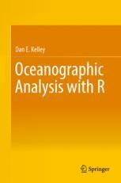

# Introduction

The `oce` package was designed by observational oceanographers (originally just Dan Kelley from Dalhousie University) to make it easy to import various oceanographic data formats into R for analysis. As time progressed, and more and more disparate data formats were supported (including data from different instrument manufacturers, e.g. SBE and RBR, but also data from different *types* of instruments, such as CTDs and ADCPs), the package evolved to incorporate other useful aspects of oceanographic analysis, including:

* seawater equation of state (`sw*()` functions, and then later the separate `gsw` package for the TEOS-10 fuctions)
* extensive support for object metadata, including units/scales
* specialized oceanographic plots (e.g. TS plots, profile plots, sections, etc)
* better image/pcolor-like plots (more Matlab/python-like, at least)
* tidal analysis (based on the canonical `t_tide` for Matlab)
* easier mapping (especially projections)
* data quality flags


## `oce` Resources

* The official [CRAN](https://cran.r-project.org/web/packages/oce/index.html) package page

* The [`oce` webpage](https://dankelley.github.io/oce/) has several useful vignettes, covering a range topics (not exhaustive) that the package touches on.

* [My blog](https://clarkrichards.org) has quite a few posts were I go through aspects of oce, including sometimes new package features that I am playing around with.

* Dan Kelley's fantastic [book](https://www.springer.com/us/book/9781493988426), "Oceanographic Analysis with R" (OAR).



# Package details

## Installing

The `oce` package is hosted on CRAN, and has been for approximately 15 years. Because it is near the size limit for packages (5 MB!), mostly due to some of the included data sets, we try not too update it too frequently (as all the old versions are also archived on the CRAN server). Typically CRAN updates happen about twice a year.

The development version of `oce` can be obtained from the [Github page](https://github.com/dankelley/oce/), and installed using `R CMD ...` or the `remotes`/`devtools` packages. Note that `oce` includes a number of tools that use compiled code, including Fortran (for the geomagnetic library), C, and C++, so in order to install the package from source you have to configure your system with the appropriate compilers and system dependencies.

Issues (i.e. bug reports, questions, feature requests, etc) can also be submitted at the [Github Issues page](https://github.com/dankelley/oce/issues). We are also happy to consider pull requests, though given the specialized nature of many of the components, it is encouraged to discuss any potential PRs with the authors before doing too much work, so ensure minimal back and forth and easier code reviews.

## Object orientation

`oce` uses the S4 object orientation system, which for me is just magical enough to be mind-blowing, and just enough of a pain-in-the-ass to figure out to be really annoying (hence, the warning about checking before going off on a crazy new PR). Probably there are better OO systems out there now, but S4 is included in base-R and the package is large so updating systems is not a small task. For users, at least, the S4 system is easy and fairly intuitive. 

## Graphics

`oce` uses base graphics exclusively for all plot types and plotting methods -- i.e. NOT ggplot2. We are old, and stubborn about our love of base graphics (stemming at least partly from the fact that the classic "data.frame" approach to analysis is often not appropriate for detailed oceanographic data objects). Similarly, the "tidyverse" functions typically won't work on `oce` objects, unless some coercion to data frames is done first (which strips out a lot of the information contained in the object).

There is an in-development package by called [`ggoce`](https://github.com/paleolimbot/ggoce) that provides some bindings for commonly-used plot types. If this is your bag, I encourage you to install and test it -- as myself and the other oce co-authors are not tidy-ggplotters and this is a great package to be driven by and contributed to by the needs of the community.

# Oce basics

## Architecture of oce objects


The need to scan diverse data files was one motivation for the creation
of `oce`, but an equal goal was to make it easy to work with the data
once they are in the system. This was accomplished partly by the
provision of specialized and generic (overloaded) functions to work with
the data, and partly by providing accessor methods that make it
convenient to reach inside the data objects (see next section).

As illustrated in Figure 1, each `oce` object contains three slots:

-   `data`, a list containing the actual data, e.g., for a CTD object
    (see also the [vignette about CTD data](ctd.html)), this will
    contain `pressure`, `temperature`, etc.
-   `metadata`, a list containing information about the data, such as
    units, data-quality flags, sampling locations, etc.
-   `processingLog`, a list that documents how the object was created
    and possibly changed thereafter.

# Accessing data in oce objects

For detailed analysis, users may want to access data *within* oce
objects. While it is possible to descend through the object using the
"slot" and "list" notation (e.g. `d@data$salinity` yields the salinity
within an oce object named `d`), this approach is not recommended. It is
better to use the `[[` notation, which derives from the generic
"Extract" method for accessing parts of an object. A general
introduction is provided by

```{r eval=FALSE}
?`[[,oce-method`
```

and details are provided for individual object classes with e.g.

```{r eval=FALSE}
?`[[,ctd-method`
```

for the `ctd` class. The notation is very simple. For example, suppose
that `d` is an object that stores `salinity` in either its `data` slot
or `metadata` slot. Then,

```{r eval=FALSE}
S <- d[['salinity']]
```

will extract the salinity.

The `[[` method first looks in the `metadata` slot, but if the item is
not found there, it proceeds to look in the `data` slot. This two-step
scheme is helpful because it frees the user from having to know where
data are stored, e.g. in a `ctd` object, `latitude` might be stored in
the `metadata` (for a conventional CTD cast) or in the `data` slot (for
the slantwise sampling of a glider).

In addition to accessing data within an object, the `[[` notation also
permits the extraction of *derived* information. There are two reasons
for this.

1.  It can give valuable performance enhancements in some cases, e.g.
    the data in the `landsat` class are stored in two byte-level arrays,
    which yields a marked improvement over the 8-byte arrays that R
    generally uses on a 64-bit machine. The `[[` assembles these
    byte-scale chunks into a conventional R numerical matrix, which can
    be quite convenient for users who wish to operate on the data
    without learning how to assemble the bytes.
2.  It provides a uniformity of notation that can be helpful to users.
    In `oce`, objects derived from data files tend to hold just the
    information in those files, not derived information. For example,
    For example, CTD datasets often provide in-situ temperature but not
    potential temperature (since the latter is not measured). The
    in-situ temperature is found with e.g. `d[["temperature"]]`, and so
    it seems natural to write `d[["theta"]]` to get the potential
    temperature. If this is done, then the `ctd` version of `[[` first
    looks in the data slot, and returns `theta` if it is found there, as
    may sometimes be the case (depending on the choice of the person who
    created the dataset). However, if it is not found, then `[[` calls
    `swTheta()` to calculate the value, and returns the result.

Finally, it is also possible to extract the entirety of either the
`metadata` or `data` slot, e.g.

```{r eval=FALSE}
data <- d[['data']]
```

yields the full data slot, which is a list with elements that can be
accessed in the conventional way, e.g. for a `ctd` object,

```{r eval=FALSE}
data$temperature
```

retrieves the temperature. For obvious reasons, the method of
derived-quantity access (e.g. the `theta` of the example above) will not
work.

# Examples

Let's try some examples!

## CTD data

There is a built-in dataset in `oce` that provides an example of CTD data. The original file is from a SeaBird CTD, is included in the package as "external data". We can read the data just like any other `.cnv` file using the all-powerful `read.oce()` function, which is a general function that farms out the file parsing to a file-specific function based on a detection of many commonly-used file types:

```{r}
library(oce)
library(magrittr)
ctdfile <- system.file("extdata", "ctd.cnv", package="oce")
print(ctdfile)
ctd_from_file <- read.oce(ctdfile)
```

Note the warning when loading the raw file about the temperature scale. This is actually a demonstration of the power of `oce` for careful work -- `oce` can keep track of, and appropriately use, the units of the fields read in from a file (when they are provided).

We can also access the oce object by loading the included Rdata object from the package:

```{r}
data(ctd)
```

Because CTD data are so common in all fields of oceanography, `ctd-class` objects make for a good example of the various features of oce and how to make both exploratory and publication-quality plots.

We can make a quick summary plot using the `ctd` plot method:

```{r include=TRUE}
plot(ctd)
```

The `ctd` plot method has MANY different panel options, based on the `which=` argument. Check out the help page with:

```{r eval=FALSE}
?`plot,ctd-method`
```

to see them all.

As demonstrated above, we can access the various parts of the object using the `[[` accessor. To see the overall structure, including the `@metadata`, `@data`, and `@processingLog` slots, do:

```{r}
str(ctd)
```

The `@metadata` slot contains much of the header information from the original file, as well as some added fields and a mapping from the "original names" to "oce names". This mapping is done so that one can always access `temperature` regardless of what the name of that field/column was in the raw data -- e.g. for the CNV file it was:

```{r}
ctd[['dataNamesOriginal']][['temperature']]
```

However, the `[[` accessor is smart enough to be able to find the field also based off of the original name:

```{r}
str(ctd[['t068']])
```

So nothing is lost in the re-mapping. The power of this approach is that temperature is temperature, no matter what instrument measured it and no matter what a particular manufacturer decided to call it in their raw file.

## CTD processing

Typically raw data from a CTD instrument doesn't come out looking as clean as the example above. Often there is a "surface soak" where the instrument equilibrates with the ambient water conditions, a "downcast" where the instrument is lowered (sensors first) through the water column, and then an "upcast" where the instrument is raised back up to the surface. 

Trimming SBE CTD data is commonly done in the SBEDataProcessing software, but this is a) closed source, b) Windows-only, and c) kind-of annoying to run (and re-run). Besides, this won't work for any non-SBE CTD such as RBR, YSI CastAway, AML, etc.

`oce` provides a number of functions that can be used to process raw CTD, including:

* `plotProfile()`: a handy profile plotting function
* `ctdTrim()`: for trimming off the soak or early data before the profile starts
* `ctdFindProfiles()`: for extracting multiple down/up casts from a multi-cast data set
* `ctdDecimate()`: for bin averaging raw (time series) data into pressure bins. Typically the last step of a CTD processing chain.

The help pages are extensive, as there are a number of arguments for each that make them very powerful at handling a wide range of real-world data.

`oce` contains a "raw" version of the `ctd` dataset, called `ctdRaw`. We can load it and take a look:

```{r}
data("ctdRaw")
plot(ctdRaw)
```
Clearly there are some issues with this data, including whacky pressures, temperatures, and salinities, in addition to a surface soak and upcast. We can look a little closer at the pressure time series, using the `plotScan()` function:

```{r}
plotScan(ctdRaw)
```

which reveals an erroneously high pressure at the start of the series, likely due to a startup transient in the circuitry or some cosmic ray (who knows, really?). Looking at the S and T time series reveals similar (check out the help page for the `:

```{r}
plot(ctdRaw, which=c(30, 31))
```

Because all of those errors occur at the beginning, we might be able to deal with them simply using `ctdTrim()`:

```{r}
ctdRaw %>% ctdTrim() %>% plotProfile()
```

That sort of worked, with all the default settings. Check out `?ctdTrim` for other settings and methods, including the "sbe" method:

```{r}
ctdRaw %>% ctdTrim(method='sbe') %>% plotProfile()
```

Much better!

Aside from soak/downcast trimming, the object orientation provides `subset()` methods for almost all `oce` objects, including ctds. The `oce` version of `subset()` works much like the default data method, but specialized for the `oce` object structure.

```{r}
ctd %>% plotTS()
ctd %>% subset(10 <= pressure & pressure <= 30) %>% plotTS(add=TRUE, col=2)
ctd %>% subset(temperature > 10) %>% plotTS(add=TRUE, col=3)
```


### Note: Reading vs creating `ctd` objects

Supported file formats create a `ctd-class` object when they are read in, but as you are aware there are as many data file formats out in the wild as there are drops in the ocean (ok, maybe that's a bit of an exaggeration ...). In cases where there isn't already a supported `read.ctd.*()` function, you can always created a `ctd` object using the `as.ctd()` function, combined with the `oceSetData()` `oceSetMetadata()` functions, e.g.

```{r}
myCTD <- as.ctd(salinity=35 + rnorm(100),
                temperature = 5 + rnorm(100),
                pressure = 1:100)
myCTD <- oceSetData(myCTD, 'nitrate', rnorm(100), unit=list(unit=expression(mu*mol),
                                                             scale=''))
myCTD <- oceSetMetadata(myCTD, 'ship', 'HMS BoatyMcBoatface')
par(mfrow=c(1, 2))
plotProfile(myCTD)
plotProfile(myCTD, xtype='nitrate')
```
The `as.ctd()` function can also be used to *coerce* other object classes into `ctd` class objects, where appropriate. This includes `rsk` objects which come from RBR instruments (not all of them are CTDs), and `argo` objects (which are sort of a special case of a ctd object).

## Seawater functions

The `oce` package contains a full suite of seawater equation of state functions, based on the "old" UNESCO formulae. Each of the functions is prefixed with `sw`, e.g. `swTheta()`, `swSCTp()` (salinity from conductivity, temperature, and pressure), etc. See the [introductory vignette](https://dankelley.github.io/oce/articles/oce.html#calculation-of-seawater-properties-1) for an overview.

Access to the "new" [TEOS-10](http://teos-10.org/) seawater functions is provided through the [`gsw` package](http://teos-10.github.io/GSW-R/) which is a dependency of `oce`. Depending on the goals, you can use either the UNESCO or TEOS direct functions, can specify the `eos=` argument in relevant functions (e.g. `plotTS()`), or you can set the option `oceEOS` to be either "unesco" or "gsw".

```{r}
getOption('oceEOS') # default is unesco
```

```{r}
par(mfrow=c(1, 2))
plotTS(ctd, eos="unesco")
plotTS(ctd, eos="gsw")
```


## Section objects

Sequences of CTD stations are often done along a line, referred to as a "ocean section", as it represents a sort of slice through the ocean over a relatively short period of time. Dealing with a pile of CTD profiles, to be strung together as a "section" can be accomplished with the `section` class in `oce`.

While there are some datasets that are actually stored with all the stations from a line in one file (see e.g. the WOCE formats), typically a `section` object is created from a *sequence* of `ctd` objects, usually contained in a list, using the `as.section()` function. A canonical example of creating a section from a directory of CTD files could be:

```{r eval=FALSE}
files <- dir('data_folder/', pattern='*.cnv')
ctd <- lapply(files, read.oce)
section <- as.section(ctd)
```

Inside, a `section` object is really just a list of `ctd` objects, with some metadata to tie them together and a suite of plotting methods that make it easy to make nice quick plots. We can experiment using the included `section` dataset in `oce`:

```{r}
data(section)
plot(section)
```
Like other `oce` objects, sections can be subsetted:

```{r}
gulf_stream <- subset(section, longitude < -70)
```

We can fancy up the plot using colours:

```{r}
plot(gulf_stream, which='temperature', ztype='image', zbreaks=4:26, col=oceColorsTemperature)
```
Section objects can also be passed to other oce plotting functions, like `plotTS()`:

```{r}
plotTS(section, pch=19)
plotTS(gulf_stream, pch=19, add=TRUE, col=2)
```

# Other topics!

Other topics that I would have loved to talk about, but you'll just have to read the book/vignettes:

* Data quality flags
* Argo data (see also the `argoFloats` package!)
* Acoustic Dopper Current Profiler (ADCP) data


